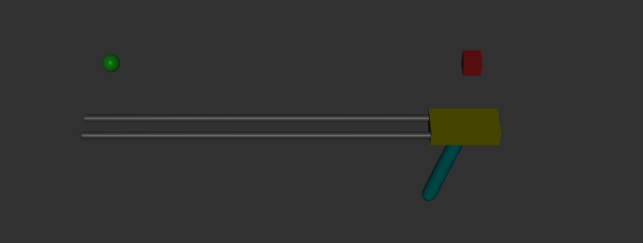
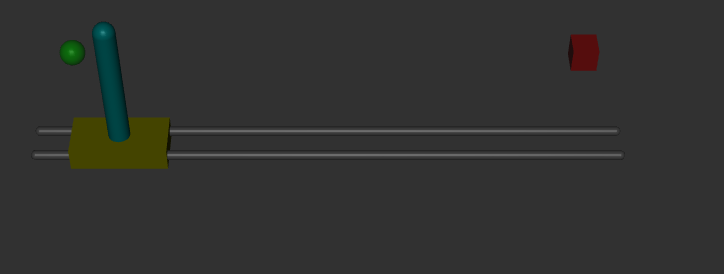

# Cartpole PID Controller - Log 
Date: 2026-02-11
  
I can move the cart with my keyboard, but I wan't to automate the process. A simple controller should do the trick, so I'll use the PID controller, since I don't really have constant movement I don't need the integral part. So it will be just a PD controller.
## Observations

- 12:00 I created the controller, now I just need to implement it for the cartpole. Since I need two forces, one per joint (slider/hinge) I will get the positional value of the cart and the angle of the pole and use them to move my cart.

- 12:26 The pole falls constantly, even when I set huge proportional gain for the stabilization force.

- 12:40 I realized that since I'm using the same function for both the movement and stabilization, the angle that goes into the error calculation is positive and follows the direction of the movement, so the stabilization force doesn't oppose the movement force. I just need to subtract the stabilization force from the movement force.

- 12:48 It does move, and keeps the pole upright, it's just going in the opposite direction. It should first go to the red cube, then to the green sphere and back and forth. I think that the issue is that the stabilization force is greater than the movement force at all times, so the movement goes in the opposite direction.
	- After trying different gain values, I realized that there is no use, I need to shift my approach.
	- After further investigation, I found that this is a case of cascaded control. Instead of setting the target to be completely vertical, I tilt the pole slightly towards the direction of the movement, this way the overall force points to the same direction. To do this I calculate the distance between the cart and the target, and set a small inclination depending on it's sign. It works.
- 14:39: Now I'm facing an issue, when the cart reaches the objective and turns, the inertia of the pole makes it fall instantly. 
- 16:26: I realized that I wasn't doing cascaded control properly. I don't move the cart anymore, I just set a clamped angle for the pole depending on the distance with the objective. Initially the angle is really big, so the cart moves in the opposite direction of the movement to try and compensate, this makes the pole go towards the objective, which in turn makes the car go toward it to prevent it from falling.

# Conclusions

In the end I used a Partial Derivative Controller, with cascaded control to make the cart move while keeping the pole standing. I learn't some things:

1. There can't be movement if the pole is exactly at 90deg consistently. At first I wanted it to stay perfectly upright.
2. 1 actuator should produce 1 force, not two. It makes no sense to have fighting forces inside an actuator.
3. Since the pole won't be perfectly upright, it's better for me to force an angle, and ask the cart to maintain it, this will make it move properly.
4. The angle should vary depending on distance and speed, I don't need a huge inclination if the cart is near the end.